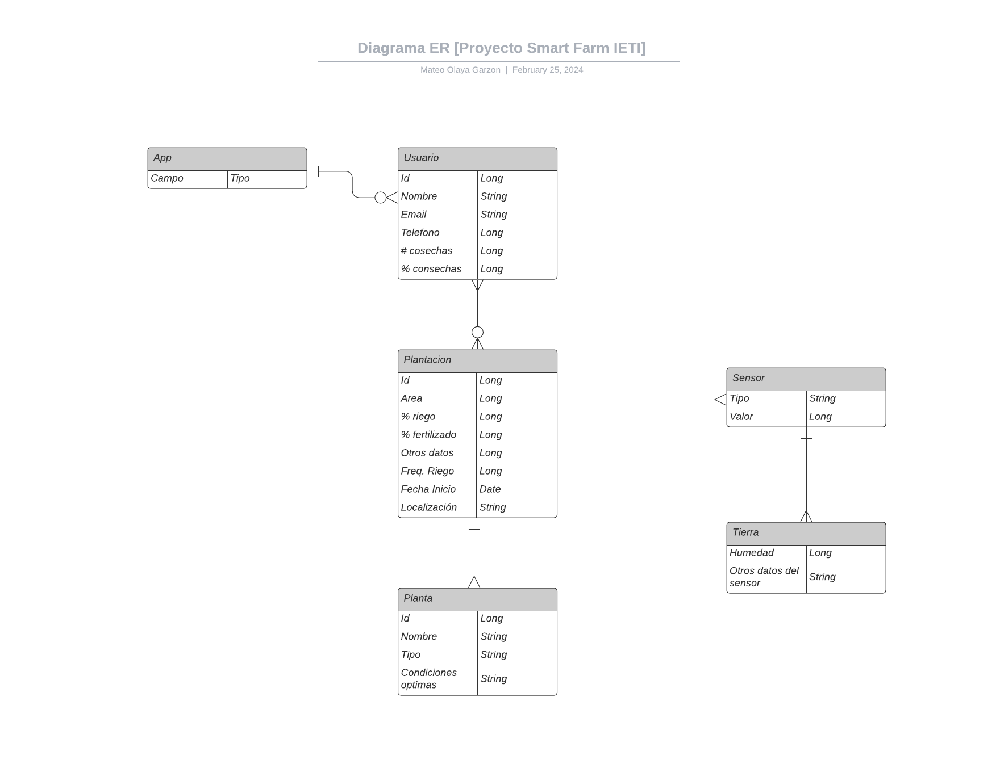
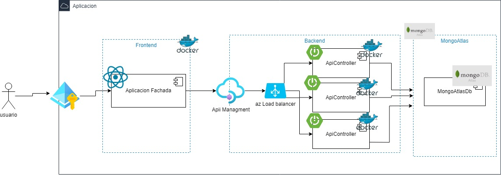

|# AGRO - GNOME

<p align="center">
  
</p>

AGRO-GNOME es una solución tecnológica que busca mejorar la eficiencia de los cultivos y reducir las perdidas mediante la implementación de herramientas IoT (Internet Of Things) e inteligencia artificial para la toma rapida y efectiva de acciones en respuesta a las condiciones y necesidades de las siembras.

## Diseño
Esta iniciativa se organiza mediante los siguientes componentes claves:

<p align="center">
  
</p>

1. `Usuarios` Los usuarios son el principal foco de atención, consiste en todos aquellos interesados en utilizar la solución tecnológica para sus plantaciones. Estos a su vez definen el esquema de datos que describe como esta distribuida la herramienta en cada instancia.
2. `Plantación` Las plantaciones son todas aquellas áreas de cultivo que posea un usuario, en este componente se describen caracteristicas que posee cada cultivo (como su área en metros cuadrados) y métricas de seguimiento (como un porcentaje de riego) ambas con la finalidad de ofrecer una retroalimentación en tiempo real sobre el estado de cada sembrado.
3. `Planta` Cada plantación posee un tipo único de planta, cada planta requiere de unas condiciones particulares para poder germinar y así dar frutos, es por ello que este componente es de vital importancia ya que ayuda a definir una adecuada retroalimentación sobre las acciones y el cuidado que se le debe dar a cada tipo de planta. Esta retroalimentación es usada por la inteligencia artificial para tomar decisiones responsivas que ayuden al continuo cuidado de estos recursos tan importantes.
4. `Sensores` Se trata de todas aquellas herramientas IoT que seran usadas para recopilar las diferentes métricas que la solución va a almacenar y procesar para ser presentadas a los usuarios en tiempo real. Además, estas métricas ayudan a alimentar la base de conocimiento de una inteligencia artificial la cual, junto a la información ofrecida por las plantas, podrá definir un contexto ideal sobre el que toda una plantación se podría regir definiendo diferentes pautas a seguir para máximizar los resultados finales de cada cultivo.

## Arquitectura

<p align="center">
  
</p>


Los componentes de esta solución estaran desplegados en contenedores dockerizados montados en la nube.

- `Seguridad` La seguridad de la aplicación se trabajará a través de la solución integrada de Microsoft [Entra ID](https://learn.microsoft.com/es-es/entra/identity/), por ende, los usuarios requeriran hacer uso de una cuenta Outlook para poder utilizar nuestros servicios.

- `Frontend` La aplicación web de usuario hará uso del framework [React](https://es.react.dev) considerando su alta flexibilidad de diseño e integración con proyectos similares.

- `Backend` La solución consiste de una API la cual atiende las peticiones realizadas por el front. En el ambiente de nube se contara con las siguientes tecnologías: 

    - [API Management](https://azure.microsoft.com/es-es/products/api-management) (Administrador de APIs de Microsoft) servicio de optimización de APIs la cual permite una mejor sincronización de las API desplegadas en nube para responder a solicitudes externas.

    - [Azure Load Balancer](https://learn.microsoft.com/en-us/azure/load-balancer/load-balancer-overview) (Administrador de cargas de red) servicio de optimización de cargas de red evitando la saturación de las redes virtuales en la nube permitiendo la instanciación de multiples instancias de componentes en este ambiente.

- `Persistence` Para el tema de la persistencia se hará uso de un cluster con [MongoDB](https://www.mongodb.com/es/cloud/atlas/lp/try4) el cual implementa una base de datos no relacional directamente conectada a cada instancia de los servicios back implementados.


## Instrucciones de uso

### Pre-requisitos

Antes de ejecutar el proyecto es necesario contar con los siguientes programas instalados y funcionando:

1. JDK 20 (Java Development Kit Version 20)
2. MVN (Maven)

### Instalación y Ejecución

A continuación se muestra el paso a paso de como instalar y ejecutar el proyecto

1. Clone este repositorio localmente en un entorno o carpeta de trabajo.

```
$ git clone https://github.com/DavidVal6/ieti_project.git
```

2. Dentro del entorno o directorio en el que clono el proyecto, asegurese de que no existan ejecutables previos o no deseados con maven.

```
$ mvn clean
```
3. Una vez que los targets han sido descartados compilelos y re asignelos al target.
```
$ mvn package
```
4. Con los target asignados, ejecute el metodo main de la clase `ProyectoApplication.java`. Dependiendo de su IDE esta clase se puede ejecutar de varias formas, en caso de no tener un IDE se recomienda el uso del siguiente comando
```
$ mvn spring-boot:run
```
5. Una vez el servicio esta corriendo puede verificar que esta funcionando al escribir la ruta en el navegador
```
http://localhost:8080/
```
6. Para revisar la documentación de la API acceda a la siguiente ruta
```
http://localhost:8080/swagger-ui/index.html
```


## Construido con

* [Maven](https://maven.apache.org/) - Manejo de dependencias
* [Spring Boot](https://spring.io/projects/spring-boot) - Framework de aplicación Java
* [Docker](https://www.docker.com) - Manejo y construcción de contenedores
* [React](https://es.react.dev) - Framework de aplicación JavaScript
* [Microsoft Azure](https://azure.microsoft.com/es-mx/resources/cloud-computing-dictionary/what-is-azure/) - Servicio de despliegue en la nube

## Version 1.0

* NOTAS
    - Este aún es un servicio de prueba, la arquitectura e implementación en la nube aún se encuentran en desarrollo.

## Autores

* [Nicolás Ariza Barbosa](https://github.com/NickArB)
* [Mateo Olaya Garzón](https://github.com/Mateo0laya)
* [Santiago Andrés Rocha Cristancho](https://github.com/SanRocks1220)
* [David Eduardo Valencia Cardona](https://github.com/DavidVal6)